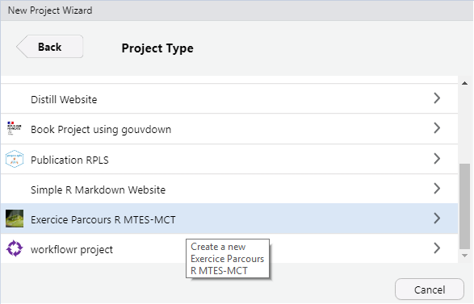
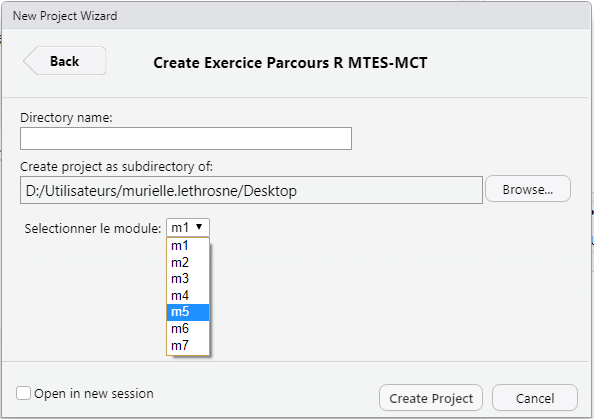

# Bien commencer

## Créer un projet sous Rstudio pour vous permettre de recencer vos travaux.

```{r collecte prez projet rstudio, warning=FALSE, echo=FALSE, results='asis'}
# Utilisation du chapitre de présentation des projets RStudio présent dans https://github.com/MTES-MCT/parcours-r
cat(text = stringi::stri_read_lines("https://raw.githubusercontent.com/MTES-MCT/parcours-r/master/parties_communes/bien_commencer.Rmd", encoding = "UTF-8"), sep = '\n')
```

## Intégrer vos données

Une bonne pratique est de créer un sous répertoire `/data` pour stocker les données sur lesquelles vous aurez à travailler. 

Vous pouvez le faire de l'explorateur de fichiers de votre système d'exploitation ou directement à partir de l'explorateur de fichiers de RStudio.

{#id .class width=500}

Cela marche bien quand on a un seul type de données, mais en général on va avoir à travailler sur des données brutes que l'on va retravailler ensuite et vouloir stocker à part. Si par la suite vous souhaitez avoir des exemples de bonnes pratiques sur comment structurer vos données, vous pouvez vous référer au [chapitre data](http://r-pkgs.had.co.nz/data.html) du livre d'Hadley Wickham sur la construction de package R (tout package R étant aussi un projet !)

## Créer votre arborescence de projet

- Créer un répertoire `/src` ou vous mettrez vos scripts R.
- Créer un répertoire `/figures` ou vous mettrez vos illustrations issues de R.

## Utilisation du package savoirfR

Pour faciliter le déroulé de ce module, l'ensemble des exercices (énoncés, corrigés et données) ont été intégrés à un package réalisé par le groupe de référent R: savoirfR

```{r , eval=F}
remotes::install_github("MTES-MCT/savoirfR")
```

Pour l'utiliser, il suffit de créer un nouveau projet dans un nouveau répertoire, en sélectionnant le "Project Type" **Exercice Parcours R MTES-MCT**.

{#id .class width=500}

Remplissez et sélectionnez le module suivi.

{#id .class width=500}

## Activer les packages nécessaires

Commencer par rajouter un script dans le répertoire `/src` à votre projet qui commencera par : 

- activer l'ensemble des packages nécessaires

- charger les données dont vous aurez besoins.


```{r _init_, eval=T}
library(knitr)
library(kableExtra)
library(ggplot2)
library(dplyr)
library(tidyr)
library(forcats)
library(hrbrthemes)
library(stringr)
library(purrr)
library(sf)
library(tmap)
library(viridis)
library(scales)
library(tmaptools)
library(leaflet)
library(cowplot)
library(glue)
library(gganimate)
library(htmlwidgets)
library(ggspatial)
library(ggiraph)
library(gifski)
# remotes::install_github("spyrales/gouvdown.fonts")
library(gouvdown.fonts)
# remotes::install_github("spyrales/gouvdown")
library(gouvdown)
# remotes::install_github("dreamRs/apexcharter")
library(apexcharter)
library(highcharter)
load("extdata/ODD.RData")
load("extdata/rpls_aggrege_large.RData")
load("extdata/rpls_aggrege.RData")
load("extdata/Carte_EPCI_France.RData")
```


## Bien structurer ses projets data

Plusieurs documents peuvent vous inspirer sur la structuration de vos projets data par la suite.

En voici quelques uns : 

- https://github.com/pavopax/new-project-template
- https://nicercode.github.io/blog/2013-04-05-projects/
- https://www.inwt-statistics.com/read-blog/a-meaningful-file-structure-for-r-projects.html
- http://projecttemplate.net/architecture.html

À partir du moment où quelques grands principes sont respectés (un répertoire pour les données brutes en lecture seule par exemple), le reste est surtout une question d'attirance plus forte pour l'une ou l'autre solution. L'important est de vous tenir ensuite à garder toujours la même structure dans vos projets afin de vous y retrouver plus simplement.
