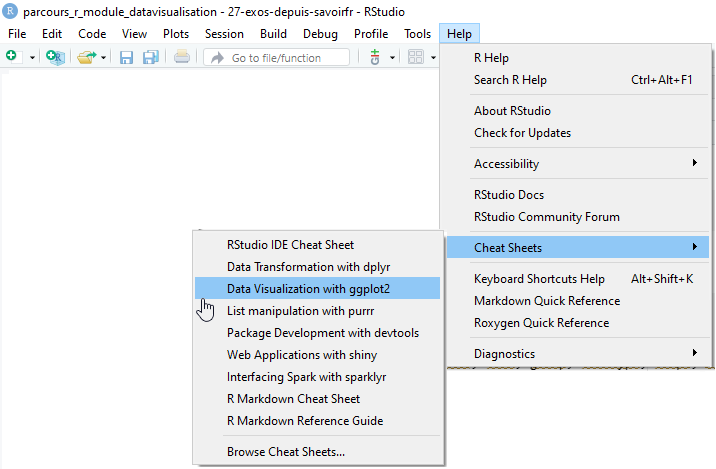

# Les formes géométriques

Pour spécifier le type de représentation que l'on souhaite, il faut utiliser les fonctions de la forme **geom_XX**

Le tableau ci-dessous présente quelques représentations graphiques classiques. 
Il en existe un grand nombre que l'on peut retrouver grâce à l'aide. 

```{r fg4_1, echo=T,eval=F,warning = FALSE,message = FALSE}
help.search("^geom_", package = "ggplot2")
```

GEOM | DESCRIPTION | AESTHETICS
---- | ----------- | ----------
geom_point() |	Nuage de points 	| x, y, shape, color, size, fill, alpha
geom_line() | Ligne | x, y, linetype, color, size, alpha
geom_bar() |	Diagramme en barres 	| x, fill, color, alpha, linetype, size, weight
geom_col() |  Diagramme en barres  	| x, y, fill, color, alpha, linetype, size
geom_histogram() |	Histogramme 	| x, fill, linetype, color, alpha, size, weight
geom_boxplot() 	| Boîte à moustaches 	| x, alpha, colour, fill, group, linetype, shape, size, weight
geom_density() 	| Courbe de densité |	x, y, alpha, color, fill, linetype, size, weight

La feuille de triche de `{ggplot2}` peut aider aussi à avoir une idée du geom qu'on cherche. 

{#id .class width=716}

Il y a deux types de diagramme en barres : `geom_bar()` et `geom_col()`.   
`geom_bar()` ne prend pas de variable `y` dans le mapping, la hauteur des barres est proportionnelle à l'occurrence de chaque modalité de `x`. On peut pondérer chaque occurrence de `x` par une autre variable à indiquer au niveau du paramètre `weight`.  

Lorsqu'on souhaite que la hauteur des barres représente une variable présente dans nos données, la fonction `geom_col()` est plus directe, car on peut y déclarer une variable à associer au paramètre `y` dans le mapping.  


```{r fg4_2, echo=T,eval=T,fig.height=3.5,warning = FALSE, message = FALSE}
ggplot(data = ODD_graphique1) +
  geom_bar(aes(Continent))
```

```{r fg4_2b, echo=T, eval=T, fig.height=3.5, warning = FALSE, message = FALSE}
filter(ODD_graphique3, Continent == "Océanie") %>%
  ggplot() +
  geom_col(aes(x = Pays, y = Mortalite2015))
```


```{r fg4_3, echo=T,eval=T,fig.height=3.5,warning = FALSE,message = FALSE}
ggplot(ODD_graphique1) +
  geom_histogram(aes(x = log(Gross_Domestic_Product_GDP)))
```

```{r fg4_4, echo=T,eval=T,fig.height=3.5,warning = FALSE,message = FALSE}
ggplot(ODD_graphique1) +
  geom_density(aes(x = log(Gross_Domestic_Product_GDP)))
```

```{r fg4_5, echo=T,eval=T,fig.height=3.5,warning = FALSE,message = FALSE}
ggplot(ODD_graphique2) +
  geom_line(aes(x = Year, y = Value))
```
