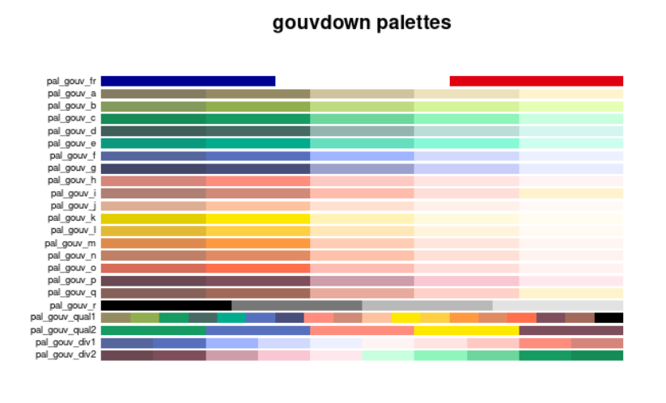

# Les thèmes

Les thèmes ggplot2 vous permettent de modifier l'apparence de vos graphiques. Derrière l'apparence, on désigne tout ce qui n'est pas relatif aux données, comme les polices de caractère, les grilles, l'arrière plan : 

- Quelle police de caractère pour le titre du graphique ? Pour le titre de l'axe des x ? 
- Quelle taille de police ? 
- Quelle couleur pour l'arrière plan ? 
- Quel type de ligne pour les grilles ?

Il existe des [thèmes prédéfinis](http://ggplot2.tidyverse.org/reference/index.html#section-themes) dans `ggplot` que l'on peut déjà utiliser.
Par exemple : `theme_classic()`, `theme_bw()`, `theme_dark()`, ...

Des packages externes permettent d'enrichir cette collection de thèmes, par exemple `ggthemes` ou `hrbrthemes`.

Lorsque l'on souhaite garder une cohérence entre plusieurs graphiques, le mieux est d'en définir un à part pour l'appeler ensuite.
La fonction de `{ggplot2}` qui vous permet de modifier le thème par défaut est la fonction `[theme()](http://ggplot2.tidyverse.org/reference/theme.html)`. Chaque élément va ensuite pouvoir être modifié finement. 

Ce schéma de [Heny Wang](https://henrywang.nl/ggplot2-theme-elements-demonstration/) permet de bien synthétiser l'ensemble des éléments thémables.
]

```{r, echo = FALSE, out.height='450px',out.width='600px',}
knitr::include_graphics("images/theme_elements.png")
```

Et nous allons ci dessous le détailler.

## Les fonctions "element"

Elle utilise 4 types de fonctions :

- ***element_text()*** : pour toutes les étiquettes

PARAMÈTRE | VALEUR
----------| --------
family | la famille de la police 
face | le type de police ("plain", "italic", "bold", "bold.italic")
colour | couleur
size | taille en points
hjust | justification horizontale, dans [0, 1]
vjust | justification verticale, dans [0, 1]
angle | angle, dans [0, 360]
lineheight | hauteur de ligne (pour l’espacement entre les lignes)

- ***element_rect()*** : pour les fonds et les cadres,

PARAMÈTRE | VALEUR
----------| ---------------------------------------------------------------
fill | la couleur de remplissage
colour | la couleur de la bordure
size | la taille de la bordure
linetype | le type de ligne ("blank", "solid", "dashed", "dotted", "dotdash", "longdash", "twodash)

- ***element_line()*** : pour toutes les lignes tracées,

PARAMÈTRE | VALEUR
----------| ---------------------------------------------------------------
colour | la couleur de ligne
size | la taille
linetype | le type de ligne ("blank", "solid", "dashed", "dotted", "dotdash","longdash", "twodash)
lineend | le type de fin de ligne ("round", "butt" ou "square")


- ***element_blank()*** : permet de ne rien dessiner.

## Les composantes

Il s'agit des différents éléments modifiables dans le thème.
Par exemple :

- **Axes**
axis.line, axis.text.x, axis.text.y, axis.ticks, axis.title.x, axis.title.y,...

- **Légende**
legend.background, legend.key, legend.text, legend.title,...

- **Fond de graphe**
panel.background, panel.border, panel.grid.major, panel.grid.minor,...

- etc


## Quelques exemples 

```{r fg7_0, echo=T,eval=T,fig.height=5,fig.width=10}
gg<-ggplot(ODD_graphique1) +
  geom_point(aes(x=log(Gross_Domestic_Product_GDP),
                 y=log(Maternal_mortality_ratio),
                 color=Continent))+
  labs(title="Mortalité maternelle en fonction du PIB par habitant",
       subtitle="En 2015",
       x="PIB",
       y="Taux de mortalité de la mère \n(pour 100 000 naissances)",
       caption="Source : ODD / ONU")
```

- Changer le fond du graphique ***panel_background***

```{r fg7_1, echo=T,eval=T,fig.height=5,fig.width=10}
gg +
  theme(panel.background = element_rect(fill="Lavender",colour="black"))
```

- Changer l'apparence du quadrillage ***panel_background***

```{r fg7_2, echo=T,eval=T,fig.height=5,fig.width=10}
gg +
  theme(panel.grid.major = element_line(colour="gray",size=0.5,linetype="dashed"))
```

- Changer l'apparence des étiquettes des axes ***axis_xxx()***

```{r fg7_3, echo=T,eval=T,fig.height=5,fig.width=10}
gg +
  theme(axis.text.x = element_text(colour = "blue", angle = 45),
        axis.title = element_text(face = "bold", colour = "orange"))
```

Certains changements de paramètres ne nécessitent pas l'utilisation de fonction ***element_()*** .
Par exemple, pour changer la position de la légende ***legend.xxx()***

```{r fg7_4, echo=T,eval=T,fig.height=5,fig.width=10}
gg +
  theme(legend.position="left",legend.title=element_blank())
```

## Modifier le thème par défaut

La fonction `theme_set()` vous permet de définir un thème par défaut pour l'ensemble de vos graphiques.

```{r fg7_5, echo=T,eval=T,fig.height=5,fig.width=10}
theme_set(theme_dark())
#Le theme_dark() sera appliqué à tous les graphiques à partir de maintenant

ggplot(ODD_graphique1) +
  geom_point(aes(x=log(Gross_Domestic_Product_GDP),
                 y=log(Maternal_mortality_ratio),
                 color=Continent))+
  labs(title="Mortalité maternelle en fonction du PIB par habitant",
       subtitle="En 2015",
       x="PIB",
       y="Taux de mortalité de la mère \n(pour 100 000 naissances)",
       caption="Source : ODD / ONU")
```

```{r , echo=T,eval=T}
#Réinitialisation d'un thème par défaut, car le noir c'est triste!
theme_set(theme_grey())

```

## Créer son propre thème

Un thème est une fonction R qui va prendre en paramètre des éléments que vous souhaitez pouvoir faire varier et fixer des éléments que vous souhaitez avoir comme rendu par défaut.
Créons un thème avec un fond vert pour le ministère de la transition écologique et solidaire. On rajoute un paramètre pour la taille de la police du titre du graphique.

```{r fg7_6}
library(hrbrthemes)
mon_theme<-function(taille_police=14){
  theme_bw()+
  theme(plot.title = element_text(color = "white",size=taille_police,face="bold"),
        text = element_text(color="white"),
        axis.text = element_text(color="white"),
        panel.background = element_rect(fill="lightgreen",colour="lightgreen"),
        plot.background= element_rect(fill="#006400",colour="lightgreen"),
        legend.background =  element_rect(fill="lightgreen",colour="lightgreen"),
        legend.key = element_blank())

}

ggplot(ODD_graphique1) +
  geom_point(aes(x=log(Gross_Domestic_Product_GDP),
                 y=log(Maternal_mortality_ratio),
                 color=Continent))+
  labs(title="Mortalité maternelle en fonction du PIB par habitant",
       subtitle="En 2015",
       x="PIB",
       y="Taux de mortalité de la mère \n(pour 100 000 naissances)",
       caption="Source : ODD / ONU")+
  mon_theme()
```

## Thème - package gouvdown

`{gouvdown}` est un package créé par la communauté [Spyrales](https://www.spyrales.fr/).

{#id .class width=500}

Il s'agit d'ensemble de fonctionnalités qui permet de produire des documents/éléments avec une charte graphique prenant en compte la marque État.

{#id .class width=500}

L’utilisation de [theme_gouv()](https://spyrales.github.io/gouvdown/reference/theme_gouv.html) permet d'appliquer cette charte.


```{r fg7_6_1}

library(gouvdown)

ggplot(ODD_graphique1) +
  geom_point(aes(x=log(Gross_Domestic_Product_GDP),
                 y=log(Maternal_mortality_ratio),
                 color=Continent))+
  labs(title="Mortalité maternelle en fonction du PIB par habitant",
       subtitle="En 2015",
       x="PIB",
       y="Taux de mortalité de la mère \n(pour 100 000 naissances)",
       caption="Source : ODD / ONU")+
  theme_gouv(plot_title_size = 15,
             subtitle_size = 11,
             base_size = 10)
```

NB: Pour les cartes, [theme_gouv_map()](https://spyrales.github.io/gouvdown/reference/theme_gouv_map.html) sera privilégié.

## Exercice 2

> A partir des données de la table graphique 1, reprendre le nuage de point obtenu à partir des données ODD : taux de mortalité maternelle (Maternal_mortality_ratio) en fonction du produit intérieur brut (Gross_Domestic_Product_GDP) (Chapitre 4.1)
> 
> En modifier le thème:
> 
> - Insérer un titre de couleur, en gras, centré par rapport au graphe.
> - Indiquer la source (ODD) et modifier sa taille
> - Changer les titres des axes et leurs tailles.
> - modifier la couleur de fond du graphe
> - modifier le type de gadrillage (pointillés)

Le résultat attendu

```{r  fg7_7, eval=T,echo=F,message=F,warning=F}
ggplot(ODD_graphique1) +
  geom_point(aes(x=log(Gross_Domestic_Product_GDP),
                 y=log(Maternal_mortality_ratio),
                 color=Continent))+ 
  labs(title="Croisement du PIB avec le taux de mortalité maternelle", y="Taux de mortalité maternelle", x="Produit Intérieur Brut", caption="Source: ODD")+
  theme(legend.position="bottom",
        plot.title=element_text(size=15, 
                                face="bold", 
                                color="blue",
                                hjust=0.5), 
        plot.caption=element_text(size=15),
        axis.title.x=element_text(size=15),  
        axis.title.y=element_text(size=15),
        panel.background = element_rect(fill = "lightblue",colour = "lightblue",size = 0.5),
        panel.grid.major = element_line( size=0.5,linetype = "dotted"),
        panel.grid.minor = element_line( size=0.5,linetype = "dotted"))
```